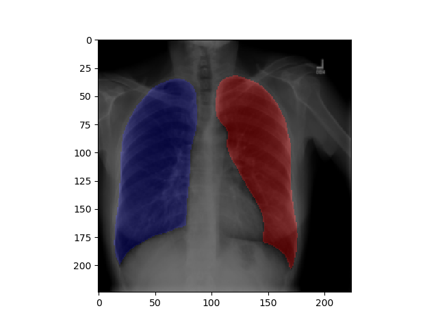
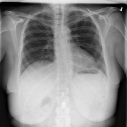
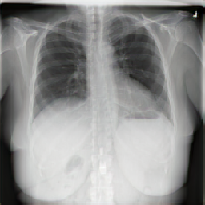

# pytorch-lung-segmentation
Lung segmentation for Pytorch Using U-Net and ResNet.

## Install
Use Python 3 for this library. [Install pytorch](https://pytorch.org/#pip-install-pytorch)  and other env requirements using Anaconda. After this, install pip packages.

    conda install --file conda_requirements.txt
    pip install -r pip_requirements.txt -e .

## Datasets required
For Lung Segmentation you can use the [Montgomery Dataset](https://ceb.nlm.nih.gov/repositories/tuberculosis-chest-x-ray-image-data-sets/), for bone shadow removal
you can use the [JSRT dataset](http://db.jsrt.or.jp/eng.php). Download them
to a place on your disk and unzip them.

## Usage

### Segmentation
For U-Net16 (the best performer) training:

    cd lung_segmentation
    python unet_train.py -p /path/to/montgomery/ -m unet16 -b 32 -e 100

For U-Net16 testing on Montgomery

    cd lung_segmentation
    python test.py /path/to/montgomery -m unet16 -t png -r unet16_100.pth

For U-Net16 testing on CXR14

    cd lung_segmentation
    python test.py /path/to/cxr14/images -m unet16 -t png -r unet16_100.pth --non-montgomery

### Bone Shadow Elimination

For Bone Shadow Elimination (BSE) training:

    cd lung_segmentation
    python bse_train.py --jsrt-path /path/to/jsrt/images --bse-path /path/to/jsrt/bone_shadow_eliminated -e 100 -m unet16

For BSE testing on CXR14

    cd lung_segmentation
    python bse_test.py -m unet16 -r unet16_bse_100.pth /path/to/cxr14/images

## Results
Utilizing a pretrained U-Net performs best at segmentation, although it is limited
to cases where there is no major opacification of the lungs or where there is no
implanted medical device. It is likely that the reason the classifier can't make
this determination is because the datasets used are so small.

BSE doesn

### Typical Segmentation Success Case

### Opacity Failure Case

### Device on Screen Failure Case

### Bone Shadow Eliminated
#### Before

#### After

## Acknowledgements
Credit is equally shared with [Sam Truong](https://github.com/Samtruong) on coding this up.
